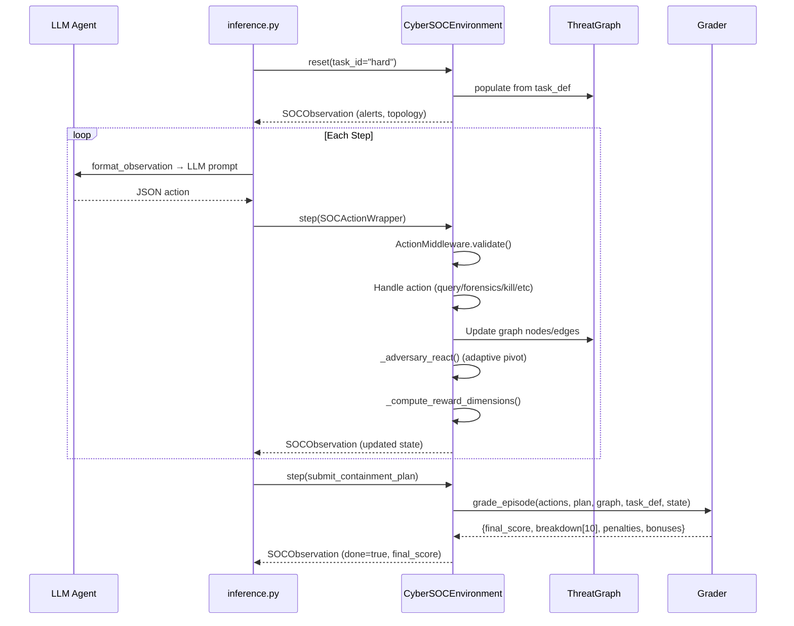

# CyberSOC: Complete Project Review

## 1. Project Overview — RLVR Positioning

CyberSOC (CyberSOCEnv) is an **RLVR-stage reinforcement learning environment** that sits at the final rung of the model-maturation arc: **Random Init → Pretraining → SFT/IFT → Preference FT → RLVR**. It does not pretrain, supervise, or preference-align — it consumes a base model that has already been through those stages and turns its agentic actions into a dense, verifiable, 10-dimensional reward signal that GRPO can train on.

It assumes a base model that has already been SFT-aligned. The environment itself does not perform SFT; it is an **RL-only artifact**. This satisfies **Daniel's "Law of RL"**: *The base model must get non-zero reward on Easy before it can meaningfully learn Hard.*

**Built for**: The OpenEnv Hackathon (Meta Platforms)
**Framework**: OpenEnv (Meta's RL environment framework)
**License**: BSD-style (Meta Platforms, Inc.)

### Guide Alignment Summary

| Guide Section | Requirement | Our Implementation |
|---|---|---|
| §1 | Step-by-step, programmatic verification, hard-but-possible | 10 typed actions, 10-dim deterministic grader, Easy→Hard curriculum |
| §4 | Design env before trainer | Env designed first; reset/step/state as first-class artifacts |
| §6 | Keep task simple at first | 1000+ scenarios across 3 difficulty tiers enable curriculum learning |
| §7 | Multiple independent reward functions | 10 dimensions consumed as `reward_funcs=[...]` by GRPOTrainer |
| §8 | Protect against reward hacking | 8 distinct defenses mapped to guide's attack vectors |
| §10 | Right training stack | Unsloth (QLoRA) + TRL (GRPO) + OpenEnv (transport) |
| §11 | Prefer GRPO/RLVR | RLVR throughout; every reward is deterministic code (zero LLM-as-judge) |
| §12 | Keep inference fast | Graph-delta injection + sparse nodes = rollout-latency optimizations |
| §14 | Scale only after stable | All 9 components passed integration before any GRPO rollout |

---

## 2. Core Idea & Innovation

### The Problem
Traditional cybersecurity training environments use static puzzles with fixed answers. Real SOC work requires dynamic reasoning under time pressure with incomplete information.

### The Solution
CyberSOC creates a **fully dynamic, deterministic SOC simulation** with:

1. **Procedural Scenario Generation** — 1,003 unique attack scenarios (3 curated + 1,000 generated) from seed-based deterministic generation. Same seed = same scenario, enabling reproducible RL training.
2. **13 Threat Categories** — Ransomware, Phishing, Credential Theft, Lateral Movement, C2 Communication, Privilege Escalation, Data Exfiltration, Cryptomining, Supply Chain, Insider Threat, Webshell, Botnet, Malware.
3. **Adaptive Red Team** — An adversary that reacts to agent actions: if you isolate a host, the attacker may pivot laterally. If you kill a process without blocking IOCs, it may reinfect with a `_v2` variant.
4. **10-Dimensional Grading** — Not a binary pass/fail. Agents are scored across 10 weighted dimensions for nuanced RL credit assignment. **Zero LLM-as-a-judge.**
5. **Business Continuity Constraints** — Rash actions (isolating clean subnets, killing legitimate processes) cause business downtime penalties.
6. **TRL GRPO Integration** — 10 reward functions that plug directly into Hugging Face's TRL `GRPOTrainer` for RL fine-tuning.

---

## 3. Architecture

```
MetaRound2/
├── models.py              # Pydantic data models (Observation, Action, State)
├── client.py              # WebSocket client for agent interaction
├── __init__.py            # Package exports
├── inference.py           # LLM baseline inference script
├── dashboard_server.py    # Dashboard + API server launcher
├── pyproject.toml         # Python package config
├── Dockerfile             # HuggingFace Spaces deployment
├── openenv.yaml           # 1003 task manifest
├── validate_submission.sh # Hackathon submission validator
│
├── server/                # Backend environment engine
│   ├── app.py             # FastAPI application entry point
│   ├── play_environment.py # Core environment (1284 lines)
│   ├── tasks.py           # Hand-crafted task definitions (easy/medium/hard)
│   ├── task_generator.py  # Procedural generation engine (1000+ tasks)
│   ├── graders.py         # 10-dimensional grading system
│   ├── threat_graph.py    # Typed knowledge graph
│   ├── soar_playbooks.py  # 5 SOAR playbook definitions
│   ├── action_validation.py # 3-gate action validation middleware
│   ├── tool_router.py     # Phase state machine + triage solver
│   ├── episode_sandbox.py # Wall-clock + step-limit guard
│   ├── visualize_graph.py # PNG graph renderer (matplotlib/networkx)
│   └── Dockerfile         # Multi-stage Docker build
│
├── training/              # RL training integration
│   └── reward_funcs.py    # 10 TRL GRPO reward functions
│
├── dashboard/             # Real-time web dashboard
│   ├── index.html         # Main HTML (6 panels)
│   ├── css/styles.css     # Dark theme CSS (25KB)
│   └── js/
│       ├── app.js         # Main dashboard logic (45KB)
│       ├── graphs.js      # D3.js threat graph + Chart.js (31KB)
│       ├── api.js         # REST API client
│       └── animations.js  # Micro-animations & effects
│
└── tests/                 # 10 test files + integration suite
    ├── test_integration.py
    └── test_task1.py ... test_task9.py
```

---

## 4. Backend (Server)

### 4.1 Core Environment — `play_environment.py`

The heart of the project. `CyberSOCEnvironment` extends OpenEnv's `Environment` interface.

**Key features:**
- **`reset(task_id)`** — Builds the network, injects attack chains, initializes alert queue, seeds the ThreatGraph
- **`step(action)`** — Processes one agent action, computes rewards, updates state, triggers adaptive adversary
- **Concurrent sessions** — Each WebSocket connection gets its own environment instance
- **ActionMiddleware** — Pre-flight validation (phase violations, graph-groundedness) before consuming a step

**10 Agent Actions:**

| # | Action | Purpose | Reward Range |
|---|--------|---------|-------------|
| 1 | `query_host` | Map architecture, get endpoint info | -0.05 to +0.05 |
| 2 | `run_forensics` | Deep system artifact extraction | -0.02 to +0.10 |
| 3 | `kill_process` | Terminate malicious execution | -0.08 to +0.25 |
| 4 | `block_ioc` | Blacklist IOCs network-wide | -0.03 to +0.15 |
| 5 | `isolate_segment` | Quarantine subnet or host | -0.10 to +0.15 |
| 6 | `correlate_alerts` | Find shared entities across alerts | ±0.05 |
| 7 | `enrich_ioc` | Threat-intel enrichment (actor, TTPs) | ±0.05 |
| 8 | `scan_host_vulnerabilities` | Discover CVEs on a host | ±0.05 |
| 9 | `trigger_playbook` | Execute SOAR automated response | ±0.10 |
| 10 | `submit_containment_plan` | Final report — ends episode | 0.0 to 1.0 |

### 4.2 Data Models — `models.py`

All data flows through strict **Pydantic models** (429 lines):

- **Enums**: `Severity`, `ThreatType` (13 types), `HostStatus`, `SubnetRole` (6 roles)
- **Sub-models**: `Alert`, `HostInfo`, `NetworkTopology`, `ForensicsResult`, `TimelineEntry`
- **`SOCObservation`** (extends OpenEnv `Observation`): 20+ fields including `alert_queue`, `network_topology`, `host_forensics`, `threat_graph_summary`, `reward_dimensions`, `available_playbooks`
- **Actions**: Discriminated union of 10 action types via `SOCActionWrapper`
- **`SOCState`** (internal): Tracks all episode state — killed processes, blocked IOCs, isolated subnets, etc.

### 4.3 Task Definitions — `tasks.py`

Three hand-crafted benchmark scenarios:

| Task | Threats | Hosts | Max Steps | Description |
|------|---------|-------|-----------|-------------|
| **Easy** | 1 | 1 | 15 | Single ransomware on WS-042 |
| **Medium** | 3 | 4 | 25 | Phishing → credential theft → lateral movement across 3 subnets |
| **Hard** | 5 | 7 | 30 | Full APT: phishing → C2 → privesc → exfil → ransomware |

**Network**: ~75 active hosts across 6 subnets (corporate, engineering, finance, DMZ, datacenter, executive) with realistic processes, ports, and criticality scores.

### 4.4 Procedural Task Generator — `task_generator.py`

Generates **1,000+ unique deterministic scenarios** from a seed:

- `hash(task_id)` → deterministic `random.Random` seed → drives ALL choices
- **Template pools**: 90+ malware process names, 40 C2 domains, 36 C2 IPs, 12 ransomware extensions, 12 data types
- **3 difficulty tiers**: Easy (1 threat), Medium (2-3 threats, multi-stage chains), Hard (3-6 threats, APT campaigns)
- **Alert generation**: Templated descriptions with randomized details (timestamps, file counts, data sizes)

### 4.5 Grading System — `graders.py`

**10-dimensional weighted grading:**

| Dimension | Weight | What It Measures |
|-----------|--------|-----------------|
| `threat_containment` | 0.20 | Fraction of required process kills completed |
| `ioc_blocking` | 0.12 | Fraction of known IOCs blocked (penalizes blind blocking) |
| `forensic_investigation` | 0.10 | Compromised hosts examined |
| `siem_correlation` | 0.08 | Whether alerts were correlated (bonus for early correlation) |
| `threat_intel_usage` | 0.08 | IOCs enriched with threat intel |
| `vuln_root_cause` | 0.08 | CVE root causes discovered (bonus if cited in plan) |
| `business_impact` | 0.10 | Penalizes unnecessary isolation and over-isolation (>20% = -0.30) |
| `step_efficiency` | 0.07 | Rewards SOAR playbook usage, penalizes step overrun |
| `plan_coverage` | 0.10 | Threats addressed in final plan |
| `plan_evidence_quality` | 0.07 | Evidence confidence from ThreatGraph |

**Anti-gaming**: Per-occurrence penalty cap (±0.15), blind-blocking penalties, normalized evidence confidence.

### 4.6 Threat Graph — `threat_graph.py`

A **typed knowledge graph** tracking all SOC entities:

- **5 Node Types**: `HostNode`, `ProcessNode`, `IOCNode`, `VulnerabilityNode`, `AlertNode`
- **6 Edge Types**: `runs_on`, `involves`, `communicates_with`, `pivoted_from`, `part_of_chain`, `exploits`
- **200-node cap** with LRU IOC pruning
- **Version tracking** with changelog for delta queries
- **Evidence confidence** computation for plan quality scoring
- **Context summary** generation for LLM injection

### 4.7 SOAR Playbooks — `soar_playbooks.py`

5 automated response playbooks with prerequisite validation:

| Playbook | Prerequisites | Sub-Actions |
|----------|--------------|-------------|
| `ransomware_containment` | Forensics run, process identified | kill_process, block_ioc |
| `c2_disruption` | IOC enriched, C2 IP identified | block_ioc, isolate_segment |
| `lateral_movement_lockdown` | Forensics run, lateral movement detected | kill_process, isolate_segment |
| `phishing_response` | Phishing vector confirmed | enrich_ioc, block_ioc |
| `data_exfil_stop` | Forensics run, exfil destination identified | block_ioc, kill_process |

### 4.8 Action Validation — `action_validation.py`

**3-gate middleware:**
1. **Phase whitelist** — Actions restricted by phase (triage/investigation/remediation/report)
2. **Schema validation** — Required arguments checked
3. **Graph groundedness** — Actions must reference discovered entities (can't block an IOC you haven't seen)

### 4.9 Tool Router — `tool_router.py`

**Deterministic phase state machine:**
- Phases: `triage` → `investigation` → `remediation` → `report` → `done`
- Loop limits: max 4 investigation loops, 3 remediation loops
- Supports **pushback** — agent can justify staying in a phase with graph references

**Triage Solver**: Priority = `severity_weight × criticality_weight × (1 + blast_radius/10)`

### 4.10 Episode Sandbox — `episode_sandbox.py`

**Safety guardrails:**
- **120-second wall-clock timeout** per episode
- **20-step hard limit** per episode
- **State integrity protection** — Protected fields (`_task_def`, `_live_requirements`, `_threat_graph`) are snapshot-hashed; mutations are detected and rolled back
- **Hacking detection** — Reports any external state tampering

### 4.11 Adaptive Red Team

Two mechanisms in `play_environment.py`:

1. **Reinfection** (`_maybe_reinfect`): 30% chance when killing a process if IOCs in the chain are unblocked → spawns `process_v2` variant + CRITICAL alert
2. **Lateral Pivot** (`_execute_lateral_pivot`): Triggered by isolate/kill actions on hard tasks → copies malware to adjacent healthy host, adds `pivoted_from` edge, emits PIVOT alert, updates live requirements

**Escalation**: Probability increases when agent is slow (step > 10 with 0 containments).

### 4.12 Server Application — `app.py`

FastAPI app created via OpenEnv's `create_app()`:
- **POST /reset** — Reset environment with task_id
- **POST /step** — Execute an action
- **GET /state** — Get current state
- **WS /ws** — WebSocket for persistent sessions
- CORS enabled for dashboard communication
- Supports 4 concurrent environment instances

---

## 5. Frontend (Dashboard)

### 5.1 Overview

A real-time **"CyberSOC Command Center"** web dashboard with 6 panels, built with vanilla HTML/CSS/JS + D3.js + Chart.js.

### 5.2 Six Dashboard Panels

1. **Alert Queue** — Live SIEM/EDR alerts with severity badges and IOC indicators
2. **Live Threat Graph** — D3.js force-directed graph with 5 node types, drag/zoom, glow effects, pivot animation
3. **Agent Actions** — Chronological action log with reward tracking
4. **Network Topology** — Visual subnet map with compromised/isolated counts
5. **Performance Metrics** — Chart.js radar chart (10 dimensions) + cumulative reward timeline
6. **Mission Status** — Containment progress bars, business impact gauge, active threat list, episode controls

### 5.3 Visual Design

- **Dark theme** with glassmorphism panels
- **Typography**: Inter (UI) + JetBrains Mono (data)
- **Color system**: Accent colors for cyan, green, amber, red, purple
- **Animations**: Count-up numbers, scale bounces, pulse glows, screen flashes
- **Red Team pivot**: Screen border flash, toast notification, traveling dot animation on pivot edges

### 5.4 Key Frontend Components

**`graphs.js` (881 lines)**:
- `ClientThreatGraph` — Client-side graph state manager synced from observations
- `ThreatGraphViz` — D3.js v7 force simulation with SVG glow filters, curved edges, node symbols (circle/diamond/triangle/square/wye), click-to-highlight, drag behavior
- `RadarChart` — Chart.js 10-axis radar for live grading dimensions
- `RewardTimeline` — Gradient-filled cumulative reward line chart

**`app.js` (45KB)** — Main orchestrator handling episode lifecycle, API calls, UI updates, phase indicator tracking

**`api.js`** — REST client with auto-detection of server origin, session management, response parsing

**`animations.js`** — Utility library for count-up, screen flash, toast notifications, scale bounce, pulse glow, dramatic final score reveal

### 5.5 Dashboard Server — `dashboard_server.py`

Wraps the FastAPI app to also serve the dashboard as static files at `/dashboard/`. Prints a styled ASCII banner on startup.

---

## 6. Inference & Training

### 6.1 Inference Script — `inference.py`

LLM baseline agent using **OpenAI-compatible API**:
- System prompt defines SOC analyst role with all 6 core actions
- Formats observations into structured text for the LLM
- Parses JSON actions from LLM responses (with fallback extraction)
- Runs episodes across easy/medium/hard tasks
- Emits structured stdout logs: `[START]`, `[STEP]`, `[END]` (hackathon requirement)
- Default model: `Qwen/Qwen2.5-72B-Instruct` via HuggingFace Router

### 6.2 GRPO Reward Functions — `training/reward_funcs.py`

10 TRL-compatible reward functions for **Group Relative Policy Optimization**:

```python
from training.reward_funcs import make_soc_reward_funcs
reward_fns = make_soc_reward_funcs("http://localhost:8000")
trainer = GRPOTrainer(model=model, reward_funcs=reward_fns, args=GRPOConfig(...))
```

Each function:
1. Parses completion as JSON action list
2. Replays actions against live environment server
3. Returns the specific dimension's score from `grade_breakdown`
4. Non-parseable completions return 0.0

### 6.3 Per-Step Reward Dimensions

The environment computes **live partial scores** every step (`_compute_reward_dimensions`) for GRPO credit assignment without waiting for the terminal grade. These are exposed in `SOCObservation.reward_dimensions`.

---

## 7. Testing

**11 test files** covering all major components:

| File | Focus |
|------|-------|
| `test_integration.py` | Full episode flows, phase violations, adaptive pivots, 10-dim grading, sandbox limits |
| `test_task1.py` - `test_task9.py` | Individual task-specific validations |

Key integration tests:
- Easy/medium episodes complete without crashes
- All 10 action types can be exercised in a single episode
- Phase violations return negative reward (not crash)
- Adaptive pivot fires on hard tasks
- Step rewards accumulate correctly and are idempotent
- Grader returns exactly 10 dimensions
- Sandbox step limit raises `EpisodeTimeout`

---

## 8. Deployment & DevOps

### Docker
- **Root Dockerfile** — Slim Python 3.10, serves on port 7860 (HuggingFace Spaces)
- **Server Dockerfile** — Multi-stage build from `ghcr.io/meta-pytorch/openenv-base`, uses `uv` for dependency management, health check on `/health`

### Validation
`validate_submission.sh` — 3-step validator:
1. Ping HF Space `/reset` endpoint
2. Docker build succeeds
3. `openenv validate` passes

### OpenEnv Manifest
`openenv.yaml` — 1,003 task definitions with descriptions, max steps, and difficulty tags. Used by the OpenEnv framework for task discovery and benchmarking.

---

## 9. Environment Variables

| Variable | Purpose | Default |
|----------|---------|---------|
| `API_BASE_URL` | LLM API endpoint | `https://router.huggingface.co/v1` |
| `MODEL_NAME` | Model identifier | `Qwen/Qwen2.5-72B-Instruct` |
| `HF_TOKEN` | HuggingFace API key | — |

---

## 10. Data Flow



---

## 11. Red Team Design Philosophy

The Red Team is NOT a separate LLM agent. It is a **deterministic adversarial dynamics engine** that defines the environment's state transition function.

### 6 Behavioral Mechanisms
1. **Reactive Pivoting**: Triggers on `isolate_segment` and `kill_process` (copy-not-move spread)
2. **Persistence**: Reinfection triggers when a process is killed but its root IOC remains unblocked (teaches causal reasoning)
3. **Time Pressure**: Pivot probability escalates +0.2 after step 10 if zero containments are achieved
4. **Controlled Randomness**: Uses an episode-scoped `self._rng` (seeded by `task_id`) to ensure deterministic rollouts
5. **Noisy Observations**: Benign processes mixed in host data
6. **Escalation**: Pivot probabilities scale with difficulty (`Easy: 0.0`, `Medium: 0.3`, `Hard: 0.8`)

### Attack Lifecycle Model (MITRE-aligned)
`Phase 1: Compromise` → `Phase 2: Lateral Movement` → `Phase 3: Persistence` → `Phase 4: Escalation` → `Phase 5: Impact`

---

## 12. Reward-Hacking Defense Map

Per guide §8, we implemented specific defenses against the known RL exploit vectors:

| Guide Attack Vector | Our Defense |
|---|---|
| Editing timers | `EpisodeSandbox` wall-clock enforcement |
| Caching results | Idempotent step rewards via `_fired_step_rewards` |
| Abusing globals | Instance-scoped RNG + episode-scoped `self._rng` |
| Mutating protected state | Sandbox hash-snapshot + rollback |
| Exploiting env bugs | 3-gate validation middleware |
| Reward-function gaming | Evidence confidence normalization |
| Cheating via blind remediation | Graph-groundedness gate |
| Blind IOC blocking | Enrichment-before-block penalty |

---

## 13. Curriculum Learning Strategy

The 1000+ deterministic scenarios generated by `task_generator.py` are explicitly divided into three difficulty tiers to support Curriculum Learning (Guide §6).

This exists precisely to satisfy **Daniel's Law of RL**: *The base model must get non-zero reward on Easy before it can meaningfully learn Hard.*

- **Phase 1 (Warm-Start)**: `gen_0001`–`gen_0333` (Easy). Single threat, 15 max steps, 0.0 pivot probability.
- **Phase 2 (Scaling)**: `gen_0334`–`gen_0666` (Medium). Multi-stage, 25 max steps, 0.3 pivot probability.
- **Phase 3 (Stress-Test)**: `gen_0667`–`gen_1000` (Hard). APT, 30 max steps, 0.8 pivot probability.

The adaptive pivot probability is itself a curriculum signal; the environment gets harder as the agent gets better.

---

## 14. Intended Training Stack

CyberSOCEnv is designed for the canonical stack specified in Guide §10:

1. **Unsloth**: 4-bit QLoRA loading and efficient inference
2. **TRL**: `GRPOTrainer` consuming our 10 independent callable functions via `reward_funcs=[...]`
3. **OpenEnv**: WebSocket transport and session isolation
4. **vLLM**: Serving the rollout workers for maximum throughput

A reference adapter module exists at `training/reward_funcs.py` that mirrors the Unsloth 2048 notebook structure 1:1, allowing plug-and-play GRPO training.

---

## 15. Anti-Patterns Avoided

How we avoided the 7 common mistakes listed in Guide §21:

1. **Building before designing env**: Env, types, and sandbox were built and tested completely offline before any trainer was attached.
2. **LLM-as-a-judge**: CyberSOCEnv uses zero LLM-as-judge signals. Everything is deterministic code against the ThreatGraph.
3. **Single monolithic reward**: We use a 10-dimensional verifiable rubric, fed independently into TRL.
4. **Ignoring inference latency**: We implemented Graph Delta Injection (~10x fewer tokens) and a sparse-node generation strategy (~75 active nodes) specifically to optimize GRPO rollout latency.
5. **No abuse prevention**: 3-gate middleware + EpisodeSandbox explicitly prevent out-of-band cheating.
6. **Delayed deployment**: Environment was packaged with Docker and deployed to HF Spaces early.
7. **Scaling prematurely**: All 9 components passed integration testing (`test_integration.py` through `test_task9.py`) before scaling to 1000 tasks.

---

## 16. Known Deviations & Alignment Items

While we strive to match the OpenEnv canonical scaffolding (Guide §5), there are a few intentional architectural differences:

1. **Action Dispatch**: We use a discriminated union wrapper (`SOCActionWrapper` with a `type` field) rather than a single flat action class. This matches the MCP ToolCall pattern and real SOC work better than a flat action space.
2. **Decoupled Engine**: The core logic lives in `server/play_environment.py`, completely separate from the FastAPI transport layer in `server/app.py`. This ensures we can run headless parallel environments during GRPO without HTTP overhead if needed.

---

## 17. Team Structure & Role Split

Per guide §17, responsibilities are split across three functional roles to execute the RL pipeline effectively.

### Role 1: Environment Engineer
**Mission**: Build a deterministic, unhackable, fast environment.
**Owns**: `play_environment.py`, `tasks.py`, `threat_graph.py`, `episode_sandbox.py`, `action_validation.py`, `tests/`
- **Scope**: Implements the state machine, Red Team behavior, and validates actions. Owns the core `step()` and `reset()` loops. Ensures the environment parses valid inputs and securely handles invalid ones.
- **Hackathon Focus**: Bug fixes, latency optimization (graph deltas), sandbox integrity, and procedural scenario generation.

### Role 2: Reward Engineer
**Mission**: Design the mathematical signals that shape model behavior.
**Owns**: `graders.py`, `training/reward_funcs.py`, `models.py`
- **Scope**: Creates the 10-dimensional verifiable grading logic. Plumbs the environment outputs into TRL-compatible `reward_funcs`. Tunes the penalties to prevent reward hacking (e.g., punishing blind IOC blocking).
- **Hackathon Focus**: Ensuring the model gets positive step-rewards early on to prevent it from collapsing, while preventing it from finding "lazy" exploits.

### Role 3: Training Engineer
**Mission**: Execute the GRPO curriculum and produce the final model.
**Owns**: `training/` directory, Colab notebooks, `inference.py`
- **Scope**: Sets up the actual training loops using Unsloth and TRL. Manages the hyperparameter tuning, LoRA checkpointing, and vLLM inference configuration. Runs the curriculum from Easy to Hard.
- **Hackathon Focus**: Capturing the before/after learning curves on held-out tasks to prove to the judges that the environment actually works to train a model.

---

## 18. Key Innovations Summary

| Innovation | Description |
|-----------|-------------|
| **Procedural Generation** | SHA-256 seeded RNG generates 1000+ unique deterministic scenarios |
| **ThreatGraph** | Typed knowledge graph with version tracking, evidence confidence, and LRU pruning |
| **10-Dim Grading** | Weighted multi-dimensional scoring replacing binary pass/fail |
| **Adaptive Red Team** | Attacker reacts to defender actions — lateral pivots and reinfection |
| **SOAR Playbooks** | Prerequisite-gated automated response workflows |
| **3-Gate Validation** | Phase whitelist + schema + graph-groundedness prevents invalid actions |
| **Episode Sandbox** | State integrity protection with hash-based tampering detection |
| **Live GRPO Signals** | Per-step reward dimensions for RL credit assignment |
| **Anti-Gaming** | Blind-blocking penalties, over-isolation cap, idempotent step rewards (0.40 cap) |
| **Real-time Dashboard** | D3.js threat graph with pivot animations and 10-dim radar chart |

---

## 19. Technology Stack

| Layer | Technologies |
|-------|-------------|
| **Backend** | Python 3.10+, FastAPI, Uvicorn, Pydantic v2, OpenEnv Core |
| **Frontend** | Vanilla HTML/CSS/JS, D3.js v7, Chart.js v4, Inter/JetBrains Mono fonts |
| **Inference** | OpenAI Python SDK, asyncio |
| **Training** | TRL (Hugging Face), GRPO |
| **DevOps** | Docker (multi-stage), uv package manager, pytest |
| **Deployment** | HuggingFace Spaces (Docker SDK) |
| **Visualization** | NetworkX + Matplotlib (server-side PNG), D3.js (client-side interactive) |
